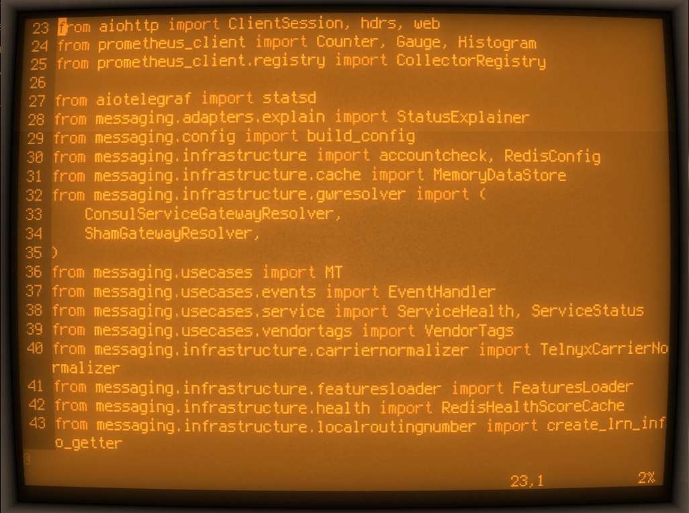

# The Shells of Telnyx

Telnyx engineers showing off their flashy/minimalist setups.

## Adding yours

Add a folder under `shells/` with your handle, include a `README.md` with info on the terminal emulator, shell, theme (font/colors), prompt, anything else cool, and a screenshot with nothing too incriminating. Pro tip: shrink the terminal to be small-ish, so it's not full of empty space.

## Gallery

### Balena

### Kane

### Nick

### Marek

### Ming

