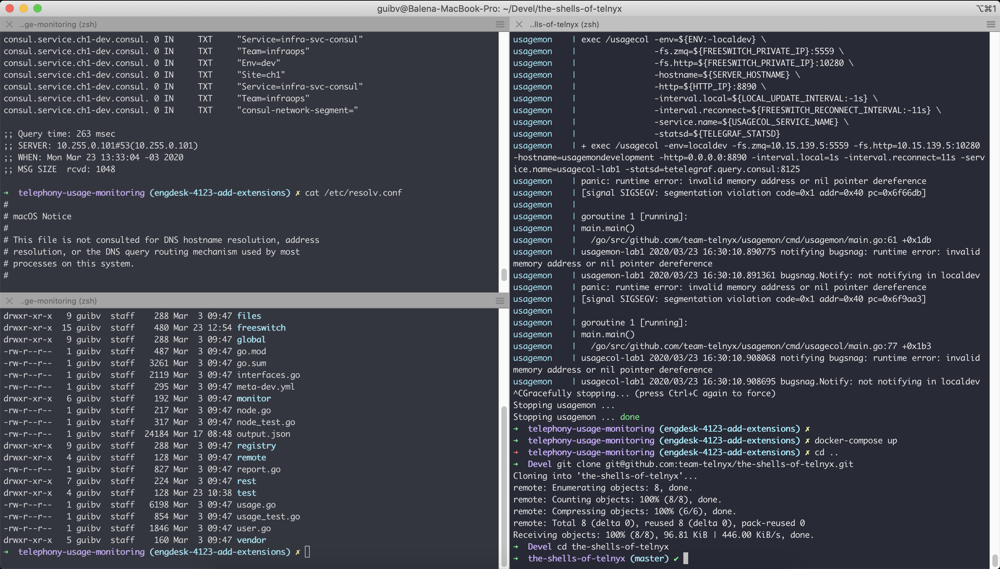

# Picture

# Details

* Terminal emulator: iTerm
* Shell: [Oh My Zsh](https://ohmyz.sh) (`zsh`)
* Color Scheme: [Dracula](https://draculatheme.com), nothing fancy here, I just like to unify all color schemes.
