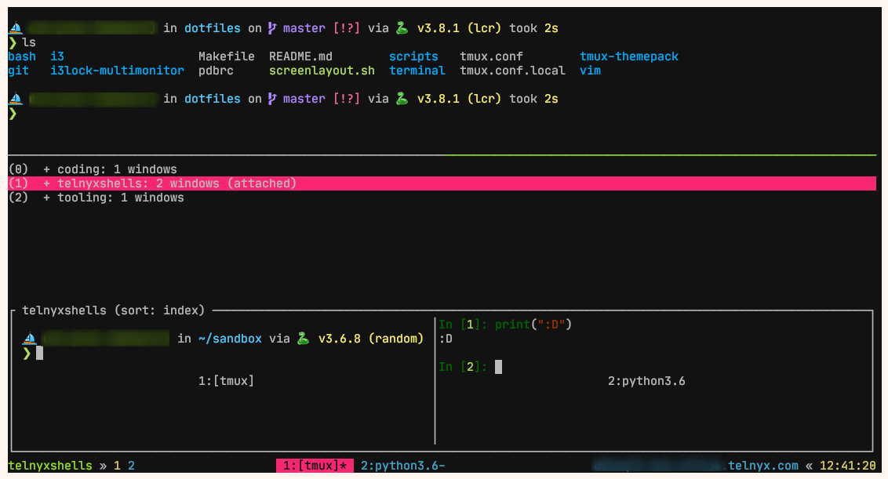

# Picture

# Details

* OS: Linux(Ubuntu)
* Terminal emulator: [wezterm](https://wezfurlong.org/wezterm/)
* Terminal multiplexer: tmux with [basic theme](https://github.com/jimeh/tmux-themepack)
* Shell: Bash
* Prompt: [Starship](https://starship.rs/)
* Font: [Jetbrains Mono](https://www.jetbrains.com/lp/mono/)
