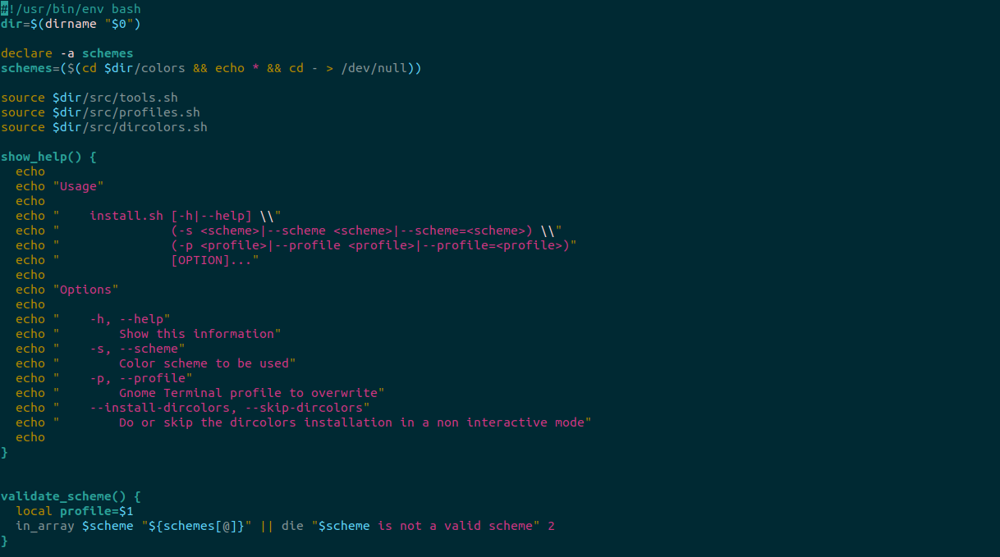

# Screenshot

# Details

* Terminal emulator: Gnome terminal
* Shell: bash
* Color Scheme: Solarized(https://ethanschoonover.com/solarized/)
* Installation instructions: For Gnome terminal(https://github.com/aruhier/gnome-terminal-colors-solarized)
